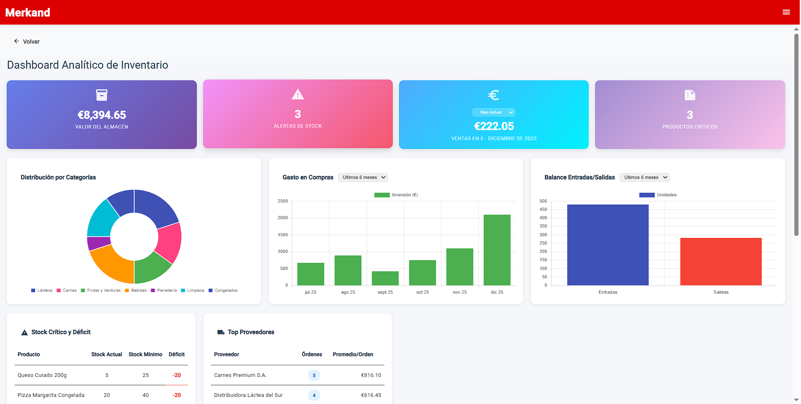
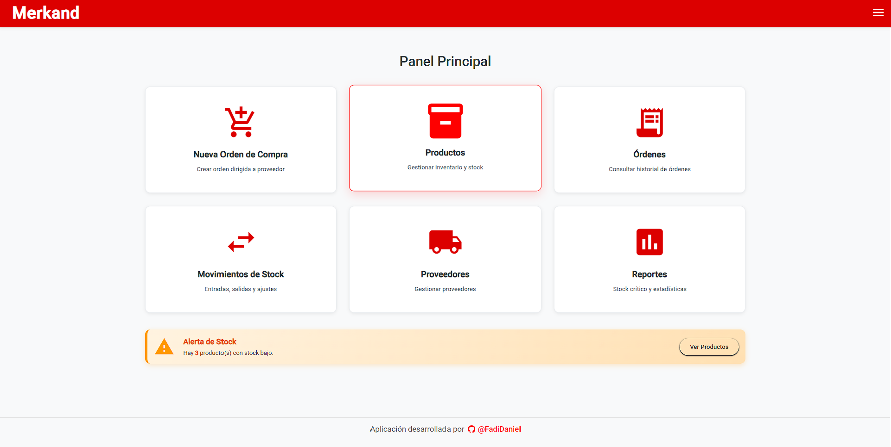
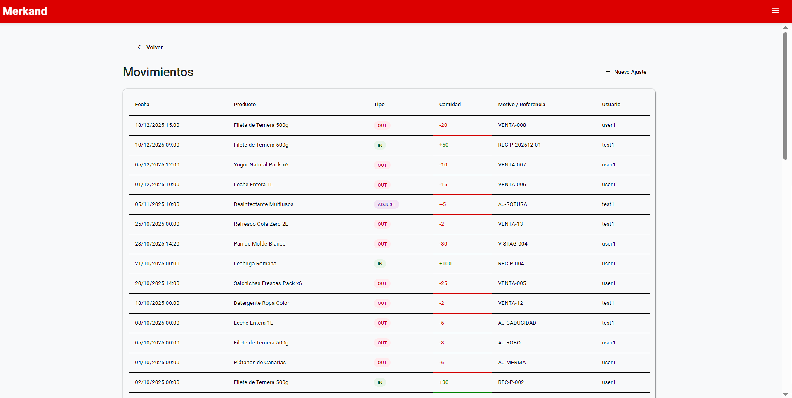
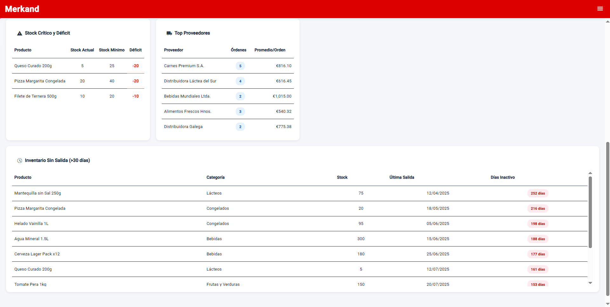
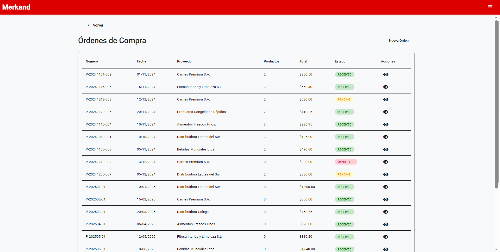
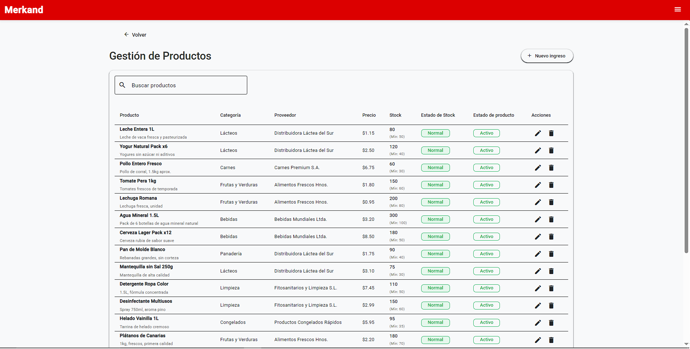
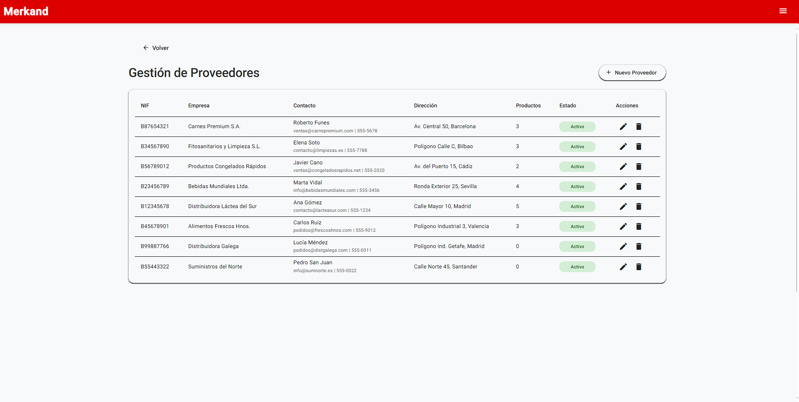

<div align="center">
  
  # Merkand Client - Aplicación Web 🛒
  
  **[English](README.md) | [Español](README.es.md)**
  
  [](https://angular.dev/)
  [](https://www.typescriptlang.org/)
  [](https://material.angular.io/)
</div>

Un sistema moderno de gestión de inventario construido con **Angular 21**, con patrones reactivos de vanguardia, componentes standalone y una arquitectura limpia diseñada para escalabilidad y mantenibilidad.

> [!IMPORTANT]
> Este proyecto requiere el backend [Merkand-API](https://github.com/FadiDaniel/Merkand-API) para funcionalidad completa.

---

## ✨ Características Principales

### Funcionalidad Core
- 🔐 **Autenticación y Autorización** con acceso basado en roles (Admin/Operador)
- 📊 **Dashboard en Tiempo Real** con estadísticas dinámicas y KPIs
- 📦 **Gestión de Productos** - Operaciones CRUD completas
- 🔄 **Gestión de Órdenes** - Manejo de transacciones de ENTRADA/SALIDA
- 📈 **Seguimiento de Movimientos** - Historial completo de movimientos de inventario
- 👥 **Gestión de Proveedores** - Control exclusivo para administradores
- 📋 **Reportes y Analíticas** - Información de inventario y ventas
- 👤 **Perfil de Usuario** - Gestión de cuenta personal
- ➕ **Registro de Usuarios** - Creación de usuarios controlada por administrador

---
## 📸 Capturas de Pantalla

| Reportes graficos |
| :---: |
|  |

| Dashboard principal | Movimientos de stock |
| :---: | :---: |
|  |  |

| Reportes tablas | Gestión de Órdenes |
| :---: | :---: |
|  |  |

| Stock de productos | Proveedores |
| :---: | :---: |
|  |  |


---

## 🏗️ Arquitectura y Patrones Modernos

Este proyecto demuestra las **mejores prácticas modernas de Angular** y sirve como implementación de referencia para aplicaciones de nivel empresarial.

### Stack Tecnológico
- **Angular 21** - Última versión del framework con APIs modernas
- **Angular Material 21** - Biblioteca completa de componentes UI
- **TypeScript 5.9** - Desarrollo con seguridad de tipos
- **RxJS 7.8** - Patrones de programación reactiva
- **Signals** - Gestión de estado reactivo integrado
- **PNPM** - Gestor de paquetes rápido y eficiente en espacio

### Patrones Modernos de Angular

#### 🎯 Componentes Standalone
Arquitectura completamente modular sin NgModules:

```typescript
@Component({
  selector: 'app-productos',
  imports: [MatCardModule, MatTableModule, CommonModule],
  templateUrl: './productos.component.html'
})
export class ProductosComponent { }
```

#### 🔔 Signals para Estado Reactivo
Gestión de estado eficiente sin sobrecarga de Zone.js:

```typescript
private productos = signal<Producto[]>([]);
readonly productos$ = this.productos.asReadonly();

// Computed signals para estado derivado
readonly productosStockBajo = computed(() =>
  this.productos().filter(p => p.stock <= p.stockMinimo)
);
```

#### 🎨 Nueva Sintaxis de Control de Flujo
Plantillas más limpias y eficientes usando `@if` y `@for`:

```html
@if (productos().length > 0) {
  <table mat-table [dataSource]="productos()">
    @for (producto of productos(); track producto.id) {
      <tr>{{ producto.nombre }}</tr>
    }
  </table>
} @else {
  <p>No hay productos disponibles</p>
}
```

#### 💉 Inyección de Dependencias Funcional
Patrón moderno `inject()` para código más limpio:

```typescript
export class ProductosComponent {
  private productoService = inject(ProductoService);
  private router = inject(Router);
}
```

#### 🛡️ Guards Funcionales
Guards de ruta con seguridad de tipos como funciones puras:

```typescript
export const authGuard: CanActivateFn = () => {
  const authService = inject(AuthService);
  return authService.isAuthenticated();
};
```

<details>
<summary><b>📁 Ver Estructura del Proyecto</b></summary>

```
src/app/
├── core/                    # Servicios singleton y guards
│   ├── guards/             # Guards de autenticación y autorización
│   ├── services/           # Servicios core (Auth, Product, Order)
│   └── interceptors/       # Interceptores HTTP (futuro)
├── shared/                  # Componentes y utilidades reutilizables
│   ├── components/         # Componentes UI compartidos
│   └── pipes/              # Pipes personalizados
├── features/                # Módulos de funcionalidades
│   ├── auth/               # Login y registro
│   ├── dashboard/          # Dashboard principal
│   ├── productos/          # Gestión de productos
│   ├── ordenes/            # Gestión de órdenes
│   ├── movimientos/        # Historial de movimientos
│   ├── proveedores/        # Gestión de proveedores
│   ├── reportes/           # Reportes y analíticas
│   └── perfil/             # Perfil de usuario
├── models/                  # Interfaces y tipos TypeScript
└── layouts/                 # Layouts de aplicación
```

</details>

---

## 🚀 Primeros Pasos

### Prerrequisitos
- **Node.js** 24.x o superior
- **PNPM** 10.x
- **Angular CLI** 21.x

### Instalación

1. **Clonar el repositorio**
   ```bash
   git clone https://github.com/FadiDaniel/Merkand-client.git
   cd Merkand-client
   ```

2. **Instalar dependencias**
   ```bash
   pnpm install
   ```

3. **Iniciar servidor de desarrollo**
   ```bash
   pnpm start
   # o
   ng serve
   ```

4. **Abrir en el navegador**
   ```
   http://localhost:4200
   ```

---

## 🔐 Credenciales de Prueba

| Rol | Usuario | Contraseña | Permisos |
|-----|---------|------------|----------|
| **Admin** | `admin1` | `admin1` | Acceso completo a todas las funcionalidades |
| **Usuario** | `user1` | `user1` | Acceso limitado (sin proveedores/registro de usuarios) |

---

## 📊 Servicios Core

### AuthService
- Autenticación de usuarios y gestión de sesión
- Persistencia basada en localStorage
- Computed signals para estado de autenticación
- Control de acceso basado en roles

### ProductoService
- Operaciones CRUD completas de productos
- Validación y alertas de stock
- Monitoreo de stock bajo
- Persistencia del lado del servidor

### OrdenService
- Creación de órdenes de ENTRADA/SALIDA
- Validación de stock para órdenes de salida
- Actualizaciones automáticas de inventario
- Generación de órdenes

---

## 🎨 UI y Diseño

### Tema Material Personalizado
Paleta de colores rosa/rojo con tipografía Roboto:

```scss
@include mat.theme((
  color: (
    primary: mat.$rose-palette,
    tertiary: mat.$red-palette,
  ),
  typography: Roboto,
  density: 0,
));
```

### Componentes Material Utilizados
- **Layout**: Cards, Tables, Sidenav, Toolbars
- **Formularios**: Campos de entrada, Select, Datepicker
- **Navegación**: Menús, Tabs
- **Retroalimentación**: Dialogs, Snackbars
- **Visualización**: Iconos, Chips, Badges

### Optimización de Rendimiento
- **Lazy Loading** para rutas secundarias
- Estrategia de detección de cambios **OnPush**
- Funciones **TrackBy** en listas
- **Computed Signals** para estado derivado

```typescript
{
  path: 'reportes',
  loadComponent: () => import('./features/reportes/reportes.component')
}
```

---

## 🛠️ Comandos Disponibles

```bash
# Desarrollo
pnpm start          # Iniciar servidor de desarrollo
pnpm build          # Build de producción
pnpm watch          # Build en modo watch

# Testing
pnpm test           # Ejecutar tests unitarios

# Calidad de Código
ng lint             # Ejecutar linter
```

---

## 🔗 Proyectos Relacionados

- **[Merkand-API](https://github.com/FadiDaniel/Merkand-API)** - API REST backend en Spring Boot

---

## 👨‍💻 Autor

**Fadi Daniel**
- GitHub: [@FadiDaniel](https://github.com/FadiDaniel)

---

<div align="center">
  <p>Construido con ❤️ usando Angular 21</p>
</div>
